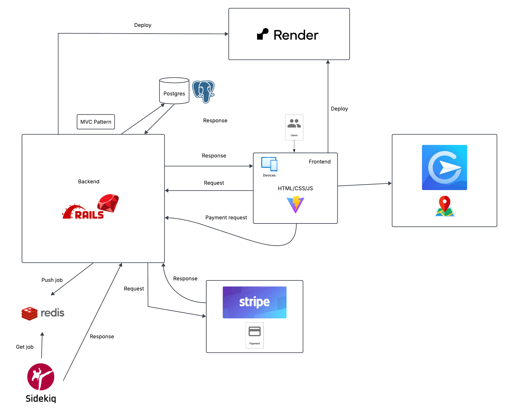

# Phase 1 - Bus Booking

Rails version 7.2

## Descriptions

- Bus booking website help us to book ticket for a journey within 63 provinces in Vietnam
- Provide tickets with reasonable price and services that meet our satisfication

## Workflow



## Database Diagram


## Prerequisites

This project requires:

- Ruby (see [.ruby-version](./.ruby-version)), preferably managed using [rbenv](https://github.com/rbenv/rbenv) or [asdf](https://asdf-vm.com/)
- Node 20.9.0
- Yarn 1.x (classic)
- PostgreSQL must be installed and accepting connections

On Ubuntu

```sh
  sudo apt update
  sudo apt install -y rbenv git curl
  curl -fsSL https://deb.nodesource.com/setup_20.9 | sudo -E bash -
  sudo apt install -y nodejs
  sudo apt install -y postgresql postgresql-contrib
  sudo apt install -y redis-server
```

On macOS, these [Homebrew](http://brew.sh) packages are recommended:

```sh
  brew install rbenv
  brew install node 20.9.0
  brew install yarn
  brew install postgresql@16
  brew install redis
```

## Getting started

## Install - setup app

To setup a development environment (MacOS):

**Clone the repo**:

```sh
  git clone https://github.com/AlvinQuach1004/coach-route-system.git
```

**Install Ruby**:

  This project currently uses [Ruby 3.3.0](blob/staging/.ruby-version), which is most easily managed through a version manager like [asdf](https://asdf-vm.com/), [rbenv](https://github.com/rbenv/rbenv)

**Install Nodejs**:

  This project user [Node 20.9.0](https://nodejs.org/en/blog/release/v20.9.0), which is most easily managed through a version manager like [asdf](https://github.com/asdf-vm/asdf-nodejs), [rvm](https://github.com/nvm-sh/nvm)

**Install Ruby gems**:

- install bundle version 2.5.4 (or similar if you are using an older version on your development)

  ```sh
  gem install bundler
  ```

- bundle

  ```sh
  bundle install
  ```

**Install with npm**.

  ```sh
    npm install
  ```

**Personalise the app settings**:

- Copy `config/database.yml.sample` to `config/database.yml` and customise the values as needed.
- Copy `.env.sample` to `.env` and customise the values as needed.

**Create database**:

```sh
  rails db:create
```

**Migrate tables**

```sh
  rails db:migrate
```


**Run seed data**:

```sh
  rails db:seed
```

**Run server**:

- rails server:

```sh
  rails s
```

- sidekiq

```sh
  bundle exec sidekiq
```

- Vite

```sh
  vite dev
```

## Development

### FE references

- DaisyUI: <https://daisyui.com/components/>
- For icons: lucide icon packages: <https://lucide.dev/icons/>

### Rspec

- Run test by:

  ```sh
    bundle exec rspec
  ```

- Check test coverage at `coverage/index.html`

### ESLint

- ESLint check:

  ```sh
    yarn lint
    npx eslint .
  ```


- ESLint check & auto fix:

  ```sh
    yarn lint:fix
    npx eslint . --fix
  ```
